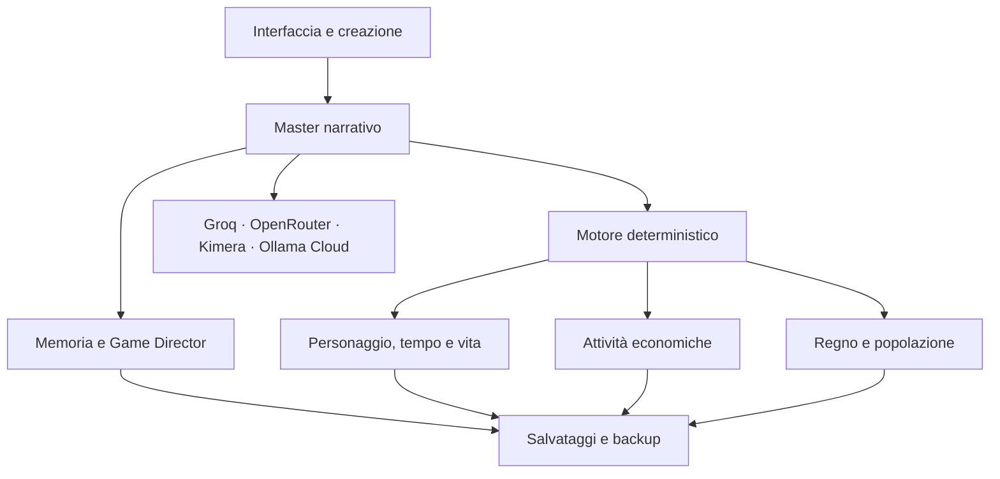

# 🐉 Cronache del Destino

> Un gioco di ruolo narrativo persistente in cui il Master LLM racconta il mondo, mentre il motore di gioco conserva memoria, tempo, risorse, attività economiche e regni.

[](https://github.com/bovel84/D-D-Crea-la-tua-storia-)
[](#-sviluppo-e-test)
[](LICENSE)

🎮 **Gioca online:** [storia-app.vercel.app](https://storia-app.vercel.app/)

---

## Il gioco

**Cronache del Destino** trasforma una conversazione con un modello linguistico in una campagna giocabile e persistente. Non è una semplice chat: il giocatore crea la propria storia e il proprio personaggio, prende decisioni, affronta prove e vede il mondo evolvere nel tempo.

Il Master LLM produce la narrazione, ma i dati importanti sono mantenuti da moduli deterministici. Denaro, salute, energia, inventario, rapporti, proprietà, imprese, popolazione e statistiche di un regno non dipendono soltanto dalla memoria del modello.

### Ciclo di gioco

1. Crea o genera una storia completa.
2. Scegli origine, ruolo, caratteristiche e dotazione del personaggio.
3. Interagisci liberamente con il mondo oppure usa le azioni rapide.
4. Affronta prove con dadi, abilità e difficoltà reali.
5. Gestisci tempo, energia, denaro, relazioni e proprietà.
6. Costruisci una carriera, amministra un'attività o governa un regno.
7. Salva la campagna e riprendila mantenendo conseguenze e memoria.

---

## ✨ Funzionalità principali

### Storie generate e modificabili

- Generazione LLM di titolo, ambientazione, conflitto, prologo e proprietà iniziali.
- Fallback locale: anche senza API viene prodotta una struttura completa e giocabile.
- Editor della storia prima dell'avvio.
- Difficoltà e patrimonio iniziale configurabili.
- Proprietà e attività iniziali trasferite realmente alla campagna.

### Master e mondo persistente

- Memoria a breve, medio e lungo termine.
- Compressione automatica e recupero dei ricordi pertinenti.
- Narrative Compass per tono, focus, trame aperte e contraddizioni.
- Game Director con eventi, pressioni e mosse del mondo.
- PNG, fazioni, luoghi e conseguenze persistenti.
- Audit prima/dopo per mantenere coerenti i sistemi gestionali.

### Personaggio e vita quotidiana

- Caratteristiche, abilità, salute e risorsa secondaria legate al genere.
- Inventario, equipaggiamento, denaro personale e proprietà.
- Dadi D4, D6, D8, D10, D12 e D20.
- Tempo deterministico con ore, giorni, mesi e stagioni.
- Energia, fame, riposo, cure, allenamento e attese.
- Famiglia, relazioni, reputazione, lavoro e crescita personale.
- Sei domini Life Legacy con esperienza, livelli e traguardi.

### Gestione delle attività

Quando il personaggio possiede un negozio, una bottega, una fattoria o un'altra impresa, viene attivato un gestionale dedicato:

- cassa aziendale separata dal denaro personale;
- catalogo, prezzi, scorte e riordini;
- fornitori, clienti e segmenti commerciali;
- dipendenti, ruoli, salari e morale;
- contratti, entrate, costi e risultato del periodo;
- differenze operative in base al tipo di attività;
- aggiornamenti narrativi trasmessi tra Master LLM e motore economico.

### Gestione del regno

Le campagne politiche o nobiliari possono attivare un modulo completo di governo:

- tesoro reale, debito, PIL, imposte, viveri e servizi;
- territori, popolazione, risorse, infrastrutture e ordine pubblico;
- esercito, consiglio, leggi, fazioni, crisi e diplomazia;
- gruppi POP con cultura, fede, professione, bisogni e desideri;
- classi sociali con ricchezza, istruzione, tenore di vita e forza politica;
- lealisti, radicali, povertà e mobilità sociale;
- mercato del lavoro con salari, posti vacanti e requisiti professionali;
- formazione e incentivi economici gestibili dal giocatore;
- audit strategico del Master e storico delle statistiche;
- dashboard responsive progettata anche per smartphone.

---

## 🌍 Generi disponibili

Ogni genere adatta caratteristiche, origini, ruoli, oggetti, valuta e regole narrative:

| Genere | Esperienza |
| --- | --- |
| Fantasy | magia, esplorazione, fazioni e regni |
| Contemporaneo | lavoro, famiglia, denaro e relazioni |
| Sport | carriera, allenamento, squadra e contratti |
| Impresa | mercato, attività, clienti e concorrenza |
| Crime | indagini, reputazione, prove e fazioni criminali |
| Storico | società, mestieri, istituzioni e tecnologie coerenti |
| Militare | missioni, logistica, morale e catena di comando |
| Diplomatico | politica, trattati, fiducia e intrighi |
| Rurale | fattoria, stagioni, raccolti e comunità |
| Pirati | nave, equipaggio, rotte e provviste |
| Spionaggio | coperture, contatti, sospetti e intelligence |

---

## 🤖 Modelli LLM supportati

Il provider si sceglie dalle impostazioni del gioco. Le chiavi API restano nel browser del giocatore e non vengono incluse nei backup.

- **Ollama Cloud**, con catalogo remoto, selezione del modello e fallback automatico.
- **Groq**, tramite endpoint compatibile OpenAI.
- **OpenRouter**, inclusi modelli gratuiti compatibili.
- **Kimera / DeepSeek**, tramite endpoint `chat/completions` configurabile.

Per Ollama Cloud l'app usa il proxy serverless:

```text
Browser o WebView → /api/ollama/chat → ollama.com/api/chat
Browser o WebView → /api/ollama/tags → ollama.com/api/tags
```

Il proxy gestisce CORS e inoltra la chiave esclusivamente all'API Ollama. Non utilizza cookie e accetta soltanto le azioni `chat` e `tags`.

---

## 🧩 Architettura



Il Master riceve un contesto autoritativo costruito dai moduli di gioco. Le risposte LLM possono contenere tag strutturati: il motore li valida, applica soltanto gli aggiornamenti coerenti e conserva il nuovo stato nella campagna.

---

## 🚀 Avvio

### Giocare online

Apri [storia-app.vercel.app](https://storia-app.vercel.app/), entra nelle impostazioni e configura almeno un provider LLM.

### Avvio locale

Il client non richiede dipendenze runtime. È sufficiente servire la cartella con un server HTTP:

```bash
git clone https://github.com/bovel84/D-D-Crea-la-tua-storia-.git
cd D-D-Crea-la-tua-storia-
npx serve .
```

Poi apri l'indirizzo locale mostrato dal terminale.

> L'apertura diretta di `index.html` può limitare chiamate di rete e moduli del browser. È preferibile usare un server HTTP locale.

### Pubblicazione su Vercel

1. Importa il repository in Vercel.
2. Mantieni la cartella principale come root del progetto.
3. Non è necessario un comando di build.
4. Distribuisci il progetto: `api/ollama/[action].js` verrà esposto come funzione serverless.

---

## 💾 Salvataggi e privacy

- Le campagne vengono salvate nel browser.
- Il Campaign Vault gestisce salvataggi, ripristino ed esportazione JSON.
- I backup hanno un controllo d'integrità.
- Chiavi API, token e secret vengono esclusi automaticamente dai backup.
- Il tesoro del regno, la cassa aziendale e il denaro personale sono separati.

---

## 📁 Struttura del progetto

```text
.
├── index.html                  # applicazione e interfaccia principale
├── css/
│   └── experience-v7.css       # tema, dashboard e responsive mobile
├── js/
│   ├── story-generator.js      # generazione e completamento delle storie
│   ├── character-options.js    # generi, origini, ruoli e dotazioni
│   ├── memory-manager.js       # memoria multilivello e retrieval
│   ├── narrative-master.js     # Narrative Compass
│   ├── game-director.js        # timeline e pressioni del mondo
│   ├── time-energy.js          # tempo, energia e metabolismo
│   ├── life-legacy.js          # crescita, rapporti e proprietà
│   ├── business-manager.js     # gestione delle attività
│   ├── kingdom-manager.js      # regno, POP e mercato del lavoro
│   ├── campaign-vault.js       # salvataggi e backup
│   ├── campaign-profile.js     # tono e focus della campagna
│   ├── experience-v7.js        # onboarding ed esperienza utente
│   └── ollama-cloud.js         # catalogo e client Ollama Cloud
├── api/ollama/
│   └── [action].js             # proxy serverless
├── tests/
│   ├── run-tests.js
│   └── check-html-script.js
├── docs/
├── LICENSE
├── README.md
└── package.json
```

---

## 🧪 Sviluppo e test

È richiesto Node.js soltanto per gli strumenti di sviluppo:

```bash
npm test
npm run check
```

La suite copre memoria, Master, generatore di storie, personaggio, tempo, salvataggi, provider, attività economiche e gestione del regno.

### Principi del progetto

- JavaScript, HTML e CSS senza framework runtime.
- Stato gestionale validato dal codice, non affidato soltanto al testo LLM.
- Migrazioni compatibili con i salvataggi precedenti.
- Moduli utilizzabili nel browser e testabili in Node.js.
- Interfaccia responsive per desktop e smartphone.

---

## 🗺️ Sviluppi futuri

- mappe dinamiche e visualizzazione dei territori;
- report strutturati per combattimenti e grandi eventi;
- ulteriori azioni politiche ed economiche;
- temi grafici specifici per genere;
- riepiloghi automatici di sessione;
- maggiore isolamento e autonomia dei PNG.

---

## 🤝 Contribuire

1. Crea un fork del repository.
2. Apri un branch dedicato.
3. Aggiungi o aggiorna i test.
4. Esegui `npm test` e `npm run check`.
5. Apri una pull request descrivendo comportamento e impatto.

---

## 📄 Licenza

[MIT](LICENSE) © 2026 Andrea Cannas
